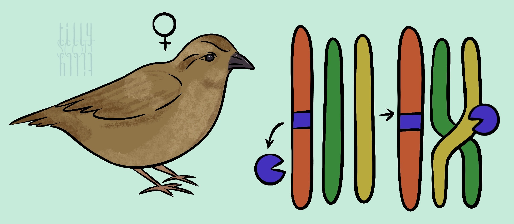

### 2024 Sparrow Recombination GWAS

This is a code repository for the article: **The genetic architecture of recombination rates is polygenic and differs between the sexes in wild house sparrows (*Passer domesticus*)**.

**Authors:** John B. McAuley, Bertrand Servin, Hamish A. Burnett, Cathrine Brekke, Lucy Peters, Ingerid J. Hagen, Alina K. Niskanen, Thor Harald Ringsby, Arild Husby, Henrik Jensen, Susan E. Johnston.

This article is in press in Molecular Biology and Evolution, and a preprint is available on [BioRxiv](https://www.biorxiv.org/content/10.1101/2023.01.26.525019v3)

The responsibility of curating the code and data is the responsibility of [Susan Johnston](Susan.Johnston@ed.ac.uk). Any questions or queries should be directed to her.

The associated raw data is archived on Dryad [here](). Note - to run these scripts, make sure to check within scripts for the appropriate directory structure for reading and writing files.

The first script to be run is `yapp_70k.sh` to generate the base data. Subsequent scripts are then run in their numerical order above.
